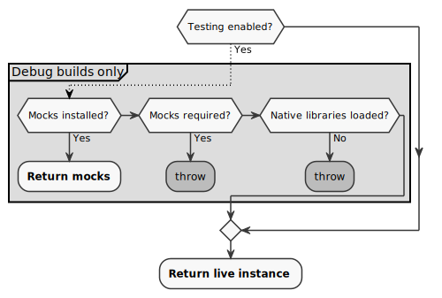

# Overview
JNI (Java Native Interface) is the mechanism that enables Java code to call
native functions, and native code to call Java functions.

 * Native code calls into Java using apis from `<jni.h>`, which basically mirror
   Java's reflection APIs.
 * Java code calls native functions by declaring body-less functions with the
  `native` keyword, and then calling them as normal Java functions.

`jni_generator` generates boiler-plate code with the goal of making our code:
 1. easier to write, and
 2. typesafe.

`jni_generator` uses regular expressions to parse .Java files, so don't do
anything too fancy. E.g.:
 * Classes must be either explicitly imported, or are assumed to be in
the same package. To use `java.lang` classes, add an explicit import.
 * Inner classes need to be referenced through the outer class. E.g.:
   `void call(Outer.Inner inner)`

The presense of any JNI within a class will result in ProGuard obfuscation for
the class to be disabled.

### Exposing Native Methods

Generally Java->Native calls are exported from the shared library and lazily
resolved by the runtime (via `dlsym()`). There are a number of notable
exceptions to this. See usage of `jni_registration_generator.py` in the
codebase.

The `jni_registration_generator.py` exposes a registration function when using
manual registation:
* `RegisterNatives` - Registers all native functions.

### Exposing Java Methods

Java methods just need to be annotated with `@CalledByNative`. The generated
functions can be put into a namespace using `@JNINamespace("your_namespace")`.

## Usage

Because the generator does not generate any source files, generated headers must
not be `#included` by multiple sources. If there are Java functions that need to
be called by multiple sources, one source should be chosen to expose the
functions to the others via additional wrapper functions.

### Calling Java -> Native

- Declare methods using a nested interface annotated with `@NativeMethods`.
- The JNI annotation processor generates a class named `${OriginalClassName}Jni`
  with a `get()` method that returns an implementation of the annotated
  interface. The C++ function that it routes to is the same as if it would be
  in the legacy method.
- For each JNI method:
  - C++ stubs are generated that forward to C++ functions that you must write.
  - If the first parameter is a C++ object (e.g.
    `long native${OriginalClassName}`), then the bindings will generate the
    appropriate cast and call into C++ code.

To add JNI to a class:

1. Enable the JNI processor by adding to your `android_library` target:
   ```python
   annotation_processor_deps = [ "//base/android/jni_generator:jni_processor" ]
   deps = [ "//base:jni_java" ]
   ```
2. Create a nested-interface annotated with `@NativeMethods` that contains
   the declaration of the corresponding static methods you wish to have
   implemented.
3. Call native functions using `${OriginalClassName}Jni.get().${method}`
4. In C++ code, #include the header `${OriginalClassName}_jni.h`. (The path will
   depend on the location of the `generate_jni` BUILD rule that lists your Java
   source code.) Only include this header from a single `.cc` file as the
   header defines functions. That `.cc` must implement your native code by
   defining non-member functions named `JNI_${OriginalClassName}_${UpperCamelCaseMethod}`
   for static methods and member functions named `${OriginalClassName}::${UpperCamelCaseMethod}`
   for non-static methods. Member functions need be declared in the header
   file as well.

Example:
#### Java
```java
class MyClass {
  // Cannot be private. Must be package or public.
  @NativeMethods
  /* package */ interface Natives {
    void foo();
    double bar(int a, int b);
    // Either the |MyClass| part of the |nativeMyClass| parameter name must
    // match the native class name exactly, or the method annotation
    // @NativeClassQualifiedName("MyClass") must be used.
    //
    // If the native class is nested, use
    // @NativeClassQualifiedName("FooClassName::BarClassName") and call the
    // parameter |nativePointer|.
    void nonStatic(long nativeMyClass);
  }

  void callNatives() {
    // MyClassJni is generated by the JNI annotation processor.
    // Storing MyClassJni.get() in a field defeats some of the desired R8
    // optimizations, but local variables are fine.
    Natives jni = MyClassJni.get();
    jni.foo();
    jni.bar(1,2);
    jni.nonStatic(mNativePointer);
  }
}
```
#### C++
```c++
#include "base/android/jni_android.h"
#include "<path to BUILD.gn>/<generate_jni target name>/MyClass_jni.h"

class MyClass {
public:
  void NonStatic(JNIEnv* env);
}

// Notice that unlike Java, function names are capitalized in C++.
// Static function names should follow this format and don't need to be declared.
void JNI_MyClass_Foo(JNIEnv* env) { ... }
void JNI_MyClass_Bar(JNIEnv* env, jint a, jint b) { ... }

// Member functions need to be declared.
void MyClass::NonStatic(JNIEnv* env) { ... }
```

**Using the 'native' keyword**

- The binding generator also looks for `native` JNI method declarations and
  generates stubs for them. This used to be the norm, but is now obsolete.
- If you have native methods that you don't want stubs generated for, you should
  add @JniIgnoreNatives to the class.

#### Testing Mockable Natives

1. Add the `JniMocker` rule to your test.
2. Call `JniMocker#mock` in a `setUp()` method for each interface you want to
   stub out.

`JniMocker` will reset the stubs during `tearDown()`.

```java
/**
 * Tests for {@link AnimationFrameTimeHistogram}
 */
@RunWith(BaseRobolectricTestRunner.class)
@Config(manifest = Config.NONE)
public class AnimationFrameTimeHistogramTest {
    @Rule
    public JniMocker mocker = new JniMocker();

    @Mock
    AnimationFrameTimeHistogram.Natives mNativeMock;

    @Before
    public void setUp() {
        MockitoAnnotations.initMocks(this);
        mocker.mock(AnimationFrameTimeHistogramJni.TEST_HOOKS, mNativeMock);
    }

    @Test
    public void testNatives() {
        AnimationFrameTimeHistogram hist = new AnimationFrameTimeHistogram("histName");
        hist.startRecording();
        hist.endRecording();
        verify(mNativeMock).saveHistogram(eq("histName"), any(long[].class), anyInt());
    }
}
```

If a native method is called without setting a mock in a unit test, an
`UnsupportedOperationException` will be thrown.

#### Special case: DFMs
DFMs have their own generated `GEN_JNI`s, which are `<module_name>_GEN_JNI`. In
order to get your DFM's JNI to use the `<module_name>` prefix, you must add your
module name into the argument of the `@NativeMethods` annotation.

So, for example, say your module was named `test_module`. You would annotate
your `Natives` interface with `@NativeMethods("test_module")`, and this would
result in `test_module_GEN_JNI`.


### Testing for readiness: use `get()`

JNI Generator automatically produces checks that verify that the Natives interface can be safely
called. These checks are compiled out of Release builds, making these an excellent way to determine
whether your code is called safely.



Most of the time you would write your code so that you only use JNI once the native libraries are
loaded. There's nothing extra you need to do here.

If you expect your code to be called by an external caller, it's often helpful to know _ahead of
time_ that the context is valid (ie. either native libraries are loaded or mocks are installed).
In this case it is helpful to call `get()` method, that performs all the Debug checks listed
above, but does not instantiate a new object for interfacing Native libraries.
Note that the unused value returned by the `get()` method will be optimized away in release builds
so there's no harm in ignoring it.

#### Addressing `Jni.get()` exceptions.

When you identify a scenario leading to an exception, relocate (or defer) the appropriate call to
be made to a place where (or time when) you know the native libraries have been initialized (eg.
`onStartWithNative`, `onNativeInitialized` etc).

Please avoid calling `LibraryLoader.isInitialized()` / `LibraryLoader.isLoaded()` in new code.
Using `LibraryLoader` calls makes unit-testing more difficult:
* this call can not verify whether Mock object is used, making the use of mocks more complicated,
* using `LibraryLoader.setLibrariesLoadedForNativeTests()` alters the state for subsequently
executed tests, inaccurately reporting flakiness and failures of these victim tests.
* Introducing `LibraryLoader.is*()` calls in your code immediately affects all callers, forcing
the authors of the code up the call stack to override `LibraryLoader` internal state in order to be
able to unit-test their code.

### Calling Native -> Java

 * Methods annotated with `@CalledByNative` will have stubs generated for them.
   * Inner class methods must provide the inner class name explicitly
     (ex. `@CalledByNative("InnerClassName")`)
 * Just call the generated stubs defined in generated `.h` files.
 * For test-only methods you want to call from native, use
   `@CalledByNativeForTesting` which will ensure that it is stripped in our
   release binaries.

### Java Objects and Garbage Collection

All pointers to Java objects must be registered with JNI in order to prevent
garbage collection from invalidating them.

For Strings & Arrays - it's common practice to use the `//base/android/jni_*`
helpers to convert them to `std::vectors` and `std::strings` as soon as
possible.

For other objects - use smart pointers to store them:
 * `ScopedJavaLocalRef<>` - When lifetime is the current function's scope.
 * `ScopedJavaGlobalRef<>` - When lifetime is longer than the current function's
   scope.
 * `JavaObjectWeakGlobalRef<>` - Weak reference (do not prevent garbage
   collection).
 * `JavaParamRef<>` - Use to accept any of the above as a parameter to a
   function without creating a redundant registration.

### Additional Guidelines / Advice

Minimize the surface API between the two sides. Rather than calling multiple
functions across boundaries, call only one (and then on the other side, call as
many little functions as required).

If a Java object "owns" a native one, store the pointer via
`"long mNativeClassName"`. Ensure to eventually call a native method to delete
the object. For example, have a `close()` that deletes the native object.

The best way to pass "compound" types across in either direction is to
create an inner class with PODs and a factory function. If possible, mark
all the fields as "final".

## Build Rules

 * `generate_jni` - Generates a header file with stubs for given `.java` files
 * `generate_jar_jni` - Generates a header file with stubs for a given `.jar`
   file
 * `generate_jni_registration` - Generates a header file with functions to
   register native-side JNI methods.

Refer to [//build/config/android/rules.gni](https://cs.chromium.org/chromium/src/build/config/android/rules.gni)
for more about the GN templates.

## Changing `jni_generator`

 * Python unit tests live in `jni_generator_tests.py`
 * A working demo app exists as `//base/android/jni_generator:sample_jni_apk`
