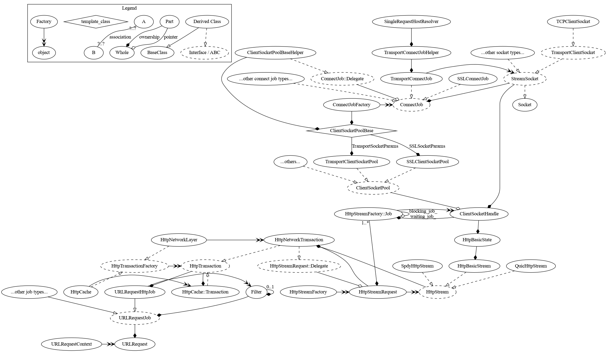
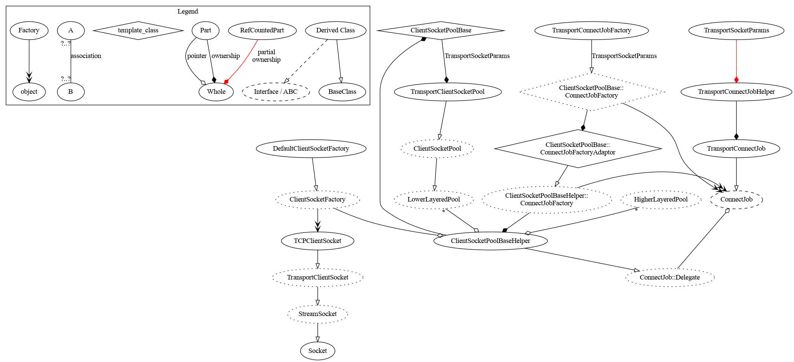

# Life of a URLRequest

This document is intended as an overview of the core layers of the network
stack and the network service, their basic responsibilities, and how they fit
together, without going into too much detail. This doc assumes the network
service is enabled, though the network service is not yet enabled by default
on any platform.

It's particularly targeted at people new to the Chrome network stack, but
should also be useful for team members who may be experts at some parts of the
stack, but are largely unfamiliar with other components. It starts by walking
through how a basic request issued by another process works its way through the
network stack, and then moves on to discuss how various components plug in.

If you notice any inaccuracies in this document, or feel that things could be
better explained, please do not hesitate to submit patches.

# Anatomy of the Network Stack

The network stack is located in //net/ in the Chrome repo, and uses the
namespace "net". Whenever a class name in this doc has no namespace, it can
generally be assumed it's in //net/ and is in the net namespace.

The top-level network stack object is the URLRequestContext. The context has
non-owning pointers to everything needed to create and issue a URLRequest. The
context must outlive all requests that use it. Creating a context is a rather
complicated process, and it's recommended that most consumers use
URLRequestContextBuilder to do this.

The primary use of the URLRequestContext is to create URLRequest objects using
URLRequestContext::CreateRequest(). The URLRequest is the main interface used
by direct consumers of the network stack. It use used to drive requests for
http, https, ftp, and some data URLs. Each URLRequest tracks a single request
across all redirects until an error occurs, it's canceled, or a final response
is received, with a (possibly empty) body.

The HttpNetworkSession is another major network stack object. It owns the
HttpStreamFactory, the socket pools, and the HTTP/2 and QUIC session pools. It
also has non-owning pointers to the network stack objects that more directly
deal with sockets.

This document does not mention either of these objects much, but at layers
above the HttpStreamFactory, objects often grab their dependencies from the
URLRequestContext, while the HttpStreamFactory and layers below it generally
get their dependencies from the HttpNetworkSession.

# How many "Delegates"?

A URLRequest informs the consumer of important events for a request using two
main interfaces: the URLRequest::Delegate interface and the NetworkDelegate
interface.

The URLRequest::Delegate interface consists of a small set of callbacks needed
to let the embedder drive a request forward. The NetworkDelegate is an object
pointed to by the URLRequestContext and shared by all requests, and includes
callbacks corresponding to most of the URLRequest::Delegate's callbacks, as
well as an assortment of other methods.

# The Network Service and Mojo

The network service, which lives in //services/network/, wraps //net/ objects,
and provides cross-process network APIs and their implementations for the rest
of Chrome. The network service uses the namespace "network" for all its classes.
The Mojo interfaces it provides are in the network::mojom namespace. Mojo is
Chrome's IPC layer. Generally there's a network::mojom::FooPtr proxy object in
the consumer's process which also implements the network::mojom::Foo interface.
When the proxy object's methods are invoked, it passes the call and all its
arguments over a Mojo IPC channel to another the implementation of the
network::mojom::Foo interface in the network service (typically implemented by a
class named network::Foo), which may be running in another process, or possibly
another thread in the consumer's process.

The network::NetworkService object is singleton that is used by Chrome to create
all other network service objects. The primary objects it is used to create are
the network::NetworkContexts, each of which owns its own mostly independent
URLRequestContext. Chrome has a number of different NetworkContexts, as there
is often a need to keep cookies, caches, and socket pools separate for different
types of requests, depending on what's making the request. Here are the main
NetworkContexts used by Chrome:

* The system NetworkContext, created and owned by Chrome's
SystemNetworkContextManager, is used for requests that aren't associated with
particular user or Profile. It has no on-disk storage, so loses all state, like
cookies, after each browser restart. It has no in-memory http cache, either.
SystemNetworkContextManager also sets up global network service preferences.
* Each Chrome Profile, including incognito Profiles, has its own NetworkContext.
Except for incognito and guest profiles, these contexts store information in
their own on-disk store, which includes cookies and an HTTP cache, among other
things. Each of these NetworkContexts is owned by a StoragePartition object in
the browser process, and created by a Profile's ProfileNetworkContextService.
* On platforms that support apps, each Profile has a NetworkContext for each app
installed on that Profile. As with the main NetworkContext, these may have
on-disk data, depending on the Profile and the App.

# Life of a Simple URLRequest

A request for data is dispatched from some other process which results in
creating a network::URLLoader in the network process. The URLLoader then
creates a URLRequest to drive the request. A protocol-specific job
(e.g. HTTP, data, file) is attached to the request. In the HTTP case, that job
first checks the cache, and then creates a network connection object, if
necessary, to actually fetch the data. That connection object interacts with
network socket pools to potentially re-use sockets; the socket pools create and
connect a socket if there is no appropriate existing socket. Once that socket
exists, the HTTP request is dispatched, the response read and parsed, and the
result returned back up the stack and sent over to the child process.

Of course, it's not quite that simple :-}.

Consider a simple request issued by some process other than the network
service's process. Suppose it's an HTTP request, the response is uncompressed,
no matching entry in the cache, and there are no idle sockets connected to the
server in the socket pool.

Continuing with a "simple" URLRequest, here's a bit more detail on how things
work.

### Request starts in some (non-network) process

Summary:

* A consumer (e.g. the content::ResourceDispatcher for Blink, the
content::NavigationURLLoaderImpl for frame navigations, or a
network::SimpleURLLoader) passes a network::ResourceRequest object and
network::mojom::URLLoaderClient Mojo channel to a
network::mojom::URLLoaderFactory, and tells it to create and start a
network::mojom::URLLoader.
* Mojo sends the network::ResourceRequest over an IPC pipe to a
network::URLLoaderFactory in the network process.

Chrome has a single browser process which handles starting and configuring other
processes, tab management, and navigation, among other things, and multiple
child processes, which are generally sandboxed and have no network access
themselves, apart from the network service (Which either runs in its own
process, or potentially in the browser process to conserve RAM). There are
multiple types of child processes (renderer, GPU, plugin, network, etc). The
renderer processes are the ones that layout webpages and run HTML.

The browser process creates the top level network::mojom::NetworkContext
objects, and uses them to create network::mojom::URLLoaderFactories, which it
can set some security-related options on, before vending them to child
processes. Child processes can then use them to directly talk to the network
service.

A consumer that wants to make a network request gets a URLLoaderFactory through
some manner, assembles a bunch of parameters in the large ResourceRequest
object, creates a network::mojom::URLLoaderClient Mojo channel for the
network::mojom::URLLoader to use to talk back to it, and then passes them to
the URLLoaderFactory, which returns a URLLoader object that it can use to
manage the network request.

### network::URLLoaderFactory sets up the request in the network service

Summary:

* network::URLLoaderFactory creates a network::URLLoader.
* network::URLLoader uses the network::NetworkContext's URLRequestContext to
create and start a URLRequest.

The URLLoaderFactory, along with all NetworkContexts and most of the network
stack, lives on a single thread in the network service. It gets a reconstituted
ResourceRequest object from the Mojo pipe, does some checks to make sure it
can service the request, and if so, creates a URLLoader, passing the request and
the NetworkContext associated with the URLLoaderFactory.

The URLLoader then calls into a URLRequestContext to create the URLRequest. The
URLRequestContext has pointers to all the network stack objects needed to issue
the request over the network, such as the cache, cookie store, and host
resolver. The URLLoader then calls into the ResourceScheduler, which may delay
starting the request, based on priority and other activity. Eventually, the
ResourceScheduler starts the request.

### Check the cache, request an HttpStream

Summary:

* The URLRequest asks the URLRequestJobFactory to create a URLRequestJob, in
this case, a URLRequestHttpJob.
* The URLRequestHttpJob asks the HttpCache to create an HttpTransaction
(always an HttpCache::Transaction).
* The HttpCache::Transaction sees there's no cache entry for the request,
and creates an HttpNetworkTransaction.
* The HttpNetworkTransaction calls into the HttpStreamFactory to request an
HttpStream.

The URLRequest then calls into the URLRequestJobFactory to create a
URLRequestJob and then starts it. In the case of an HTTP or HTTPS request, this
will be a URLRequestHttpJob. The URLRequestHttpJob attaches cookies to the
request, if needed.

The URLRequestHttpJob calls into the HttpCache to create an
HttpCache::Transaction. If there's no matching entry in the cache, the
HttpCache::Transaction will just call into the HttpNetworkLayer to create an
HttpNetworkTransaction, and transparently wrap it. The HttpNetworkTransaction
then calls into the HttpStreamFactory to request an HttpStream to the server.

### Create an HttpStream

Summary:

* HttpStreamFactory creates an HttpStreamFactory::Job.
* HttpStreamFactory::Job calls into the TransportClientSocketPool to
populate an ClientSocketHandle.
* TransportClientSocketPool has no idle sockets, so it creates a
TransportConnectJob and starts it.
* TransportConnectJob creates a StreamSocket and establishes a connection.
* TransportClientSocketPool puts the StreamSocket in the ClientSocketHandle,
and calls into HttpStreamFactory::Job.
* HttpStreamFactory::Job creates an HttpBasicStream, which takes
ownership of the ClientSocketHandle.
* It returns the HttpBasicStream to the HttpNetworkTransaction.

The HttpStreamFactory::Job creates a ClientSocketHandle to hold a socket,
once connected, and passes it into the ClientSocketPoolManager. The
ClientSocketPoolManager assembles the TransportSocketParams needed to
establish the connection and creates a group name ("host:port") used to
identify sockets that can be used interchangeably.

The ClientSocketPoolManager directs the request to the
TransportClientSocketPool, since there's no proxy and it's an HTTP request. The
request is forwarded to the pool's ClientSocketPoolBase<TransportSocketParams>'s
ClientSocketPoolBaseHelper. If there isn't already an idle connection, and there
are available socket slots, the ClientSocketPoolBaseHelper will create a new
TransportConnectJob using the aforementioned params object. This Job will do the
actual DNS lookup by calling into the HostResolverImpl, if needed, and then
finally establishes a connection.

Once the socket is connected, ownership of the socket is passed to the
ClientSocketHandle. The HttpStreamFactory::Job is then informed the
connection attempt succeeded, and it then creates an HttpBasicStream, which
takes ownership of the ClientSocketHandle. It then passes ownership of the
HttpBasicStream back to the HttpNetworkTransaction.

### Send request and read the response headers

Summary:

* HttpNetworkTransaction gives the request headers to the HttpBasicStream,
and tells it to start the request.
* HttpBasicStream sends the request, and waits for the response.
* The HttpBasicStream sends the response headers back to the
HttpNetworkTransaction.
* The response headers are sent up through the URLRequest, to the
network::URLLoader.
* They're then sent to the network::mojom::URLLoaderClient via Mojo.

The HttpNetworkTransaction passes the request headers to the HttpBasicStream,
which uses an HttpStreamParser to (finally) format the request headers and body
(if present) and send them to the server.

The HttpStreamParser waits to receive the response and then parses the HTTP/1.x
response headers, and then passes them up through both the
HttpNetworkTransaction and HttpCache::Transaction to the URLRequestHttpJob. The
URLRequestHttpJob saves any cookies, if needed, and then passes the headers up
to the URLRequest and on to the network::URLLoader, which sends the data over
a Mojo pipe to the network::mojom::URLLoaderClient, passed in to the URLLoader
when it was created.

### Response body is read

Summary:

* network::URLLoader creates a raw Mojo data pipe, and passes one end to the
network::mojom::URLLoaderClient.
* The URLLoader requests shared memory buffer from the Mojo data pipe.
* The URLLoader tells the URLRequest to write to the memory buffer, and tells
the pipe when data has been written to the buffer.
* The last two steps repeat until the request is complete.

Without waiting to hear back from the network::mojom::URLLoaderClient, the
network::URLLoader allocates a raw mojo data pipe, and passes the client the
read end of the pipe. The URLLoader then grabs an IPC buffer from the pipe,
and passes a 64KB body read request down through the URLRequest all the way
down to the HttpStreamParser. Once some data is read, possibly less than 64KB,
the number of bytes read makes its way back to the URLLoader, which then tells
the Mojo pipe the read was complete, and then requests another buffer from the
pipe, to continue writing data to. The pipe may apply back pressure, to limit
the amount of unconsumed data that can be in shared memory buffers at once.
This process repeats until the response body is completely read.

### URLRequest is destroyed

Summary:

* When complete, the network::URLLoaderFactory deletes the network::URLLoader,
which deletes the URLRequest.
* During destruction, the HttpNetworkTransaction determines if the socket is
reusable, and if so, tells the HttpBasicStream to return it to the socket pool.

When the URLRequest informs the network::URLLoader the request is complete, the
URLLoader passes the message along to the network::mojom::URLLoaderClient, over
its Mojo pipe, before telling the URLLoaderFactory to destroy the URLLoader,
which results in destroying the URLRequest and closing all Mojo pipes related to
the request.

When the HttpNetworkTransaction is being torn down, it figures out if the
socket is reusable. If not, it tells the HttpBasicStream to close the socket.
Either way, the ClientSocketHandle returns the socket is then returned to the
socket pool, either for reuse or so the socket pool knows it has another free
socket slot.

### Object Relationships and Ownership

A sample of the object relationships involved in the above process is
diagramed here:

There are a couple of points in the above diagram that do not come
clear visually:

* The method that generates the filter chain that is hung off the
  URLRequestJob is declared on URLRequestJob, but the only current
  implementation of it is on URLRequestHttpJob, so the generation is
  shown as happening from that class.
* HttpTransactions of different types are layered; i.e. a
  HttpCache::Transaction contains a pointer to an HttpTransaction, but
  that pointed-to HttpTransaction generally is an
  HttpNetworkTransaction.

# Additional Topics

## HTTP Cache

The HttpCache::Transaction sits between the URLRequestHttpJob and the
HttpNetworkTransaction, and implements the HttpTransaction interface, just like
the HttpNetworkTransaction. The HttpCache::Transaction checks if a request can
be served out of the cache. If a request needs to be revalidated, it handles
sending a conditional revalidation request over the network. It may also break a
range request into multiple cached and non-cached contiguous chunks, and may
issue multiple network requests for a single range URLRequest.

The HttpCache::Transaction uses one of three disk_cache::Backends to actually
store the cache's index and files: The in memory backend, the blockfile cache
backend, and the simple cache backend. The first is used in incognito. The
latter two are both stored on disk, and are used on different platforms.

One important detail is that it has a read/write lock for each URL. The lock
technically allows multiple reads at once, but since an HttpCache::Transaction
always grabs the lock for writing and reading before downgrading it to a read
only lock, all requests for the same URL are effectively done serially. The
renderer process merges requests for the same URL in many cases, which mitigates
this problem to some extent.

It's also worth noting that each renderer process also has its own in-memory
cache, which has no relation to the cache implemented in net/, which lives in
the network service.

## Cancellation

A consumer can cancel a request at any time by deleting the
network::mojom::URLLoader pipe used by the request. This will cause the
network::URLLoader to destroy itself and its URLRequest.

When an HttpNetworkTransaction for a cancelled request is being torn down, it
figures out if the socket the HttpStream owns can potentially be reused, based
on the protocol (HTTP / HTTP/2 / QUIC) and any received headers. If the socket
potentially can be reused, an HttpResponseBodyDrainer is created to try and
read any remaining body bytes of the HttpStream, if any, before returning the
socket to the SocketPool. If this takes too long, or there's an error, the
socket is closed instead. Since this all happens at the layer below the cache,
any drained bytes are not written to the cache, and as far as the cache layer is
concerned, it only has a partial response.

## Redirects

The URLRequestHttpJob checks if headers indicate a redirect when it receives
them from the next layer down (typically the HttpCache::Transaction). If they
indicate a redirect, it tells the cache the response is complete, ignoring the
body, so the cache only has the headers. The cache then treats it as a complete
entry, even if the headers indicated there will be a body.

The URLRequestHttpJob then checks with the URLRequest if the redirect should be
followed. The URLRequest then informs the network::URLLoader about the redirect,
which passes information about the redirect to network::mojom::URLLoaderClient,
in the consumer process. Whatever issued the original request then checks
if the redirect should be followed.

If the redirect should be followed, the URLLoaderClient calls back into the
URLLoader over the network::mojom::URLLoader Mojo interface, which tells the
URLRequest to follow the redirect. The URLRequest then creates a new
URLRequestJob to send the new request. If the URLLoaderClient chooses to
cancel the request instead, it can delete the network::mojom::URLLoader
pipe, just like the cancellation case discussed above. In either case, the
old HttpTransaction is destroyed, and the HttpNetworkTransaction attempts to
drain the socket for reuse, as discussed in the previous section.

In some cases, the consumer may choose to handle a redirect itself, like
passing off the redirect to a ServiceWorker. In this case, the consumer cancels
the request and then calls into some other network::mojom::URLLoaderFactory
with the new URL to continue the request.

## Filters (gzip, deflate, brotli, etc)

When the URLRequestHttpJob receives headers, it sends a list of all
Content-Encoding values to Filter::Factory, which creates a (possibly empty)
chain of filters. As body bytes are received, they're passed through the
filters at the URLRequestJob layer and the decoded bytes are passed back to the
URLRequest::Delegate.

Since this is done above the cache layer, the cache stores the responses prior
to decompression. As a result, if files aren't compressed over the wire, they
aren't compressed in the cache, either.

## Socket Pools

The ClientSocketPoolManager is responsible for assembling the parameters needed
to connect a socket, and then sending the request to the right socket pool.
Each socket request sent to a socket pool comes with a socket params object, a
ClientSocketHandle, and a "group name". The params object contains all the
information a ConnectJob needs to create a connection of a given type, and
different types of socket pools take different params types. The
ClientSocketHandle will take temporary ownership of a connected socket and
return it to the socket pool when done. All connections with the same group name
in the same pool can be used to service the same connection requests, so it
consists of host, port, protocol, and whether "privacy mode" is enabled for
sockets in the goup.

All socket pool classes derive from the ClientSocketPoolBase<SocketParamType>.
The ClientSocketPoolBase handles managing sockets - which requests to create
sockets for, which requests get connected sockets first, which sockets belong
to which groups, connection limits per group, keeping track of and closing idle
sockets, etc. Each ClientSocketPoolBase subclass has its own ConnectJob type,
which establishes a connection using the socket params, before the pool hands
out the connected socket.

### Socket Pool Layering

Some socket pools are layered on top other socket pools. This is done when a
"socket" in a higher layer needs to establish a connection in a lower level
pool and then take ownership of it as part of its connection process. For
example, each socket in the SSLClientSocketPool is layered on top of a socket
in the TransportClientSocketPool. There are a couple additional complexities
here.

From the perspective of the lower layer pool, all of its sockets that a higher
layer pools owns are actively in use, even when the higher layer pool considers
them idle. As a result, when a lower layer pool is at its connection limit and
needs to make a new connection, it will ask any higher layer pools to close an
idle connection if they have one, so it can make a new connection.

Since sockets in the higher layer pool are also in a group in the lower layer
pool, they must have their own distinct group name. This is needed so that, for
instance, SSL and HTTP connections won't be grouped together in the
TcpClientSocketPool, which the SSLClientSocketPool sits on top of.

### Socket Pool Class Relationships

The relationships between the important classes in the socket pools is
shown diagrammatically for the lowest layer socket pool
(TransportSocketPool) below.

The ClientSocketPoolBase is a template class templatized on the class
containing the parameters for the appropriate type of socket (in this
case TransportSocketParams). It contains a pointer to the
ClientSocketPoolBaseHelper, which contains all the type-independent
machinery of the socket pool.

When socket pools are initialized, they in turn initialize their
templatized ClientSocketPoolBase member with an object with which it
should create connect jobs. That object must derive from
ClientSocketPoolBase::ConnectJobFactory templatized by the same type
as the ClientSocketPoolBase. (In the case of the diagram above, that
object is a TransportConnectJobFactory, which derives from
ClientSocketPoolBase::ConnectJobFactory&lt;TransportSocketParams&gt;.)
Internally, that object is wrapped in a type-unsafe wrapper
(ClientSocketPoolBase::ConnectJobFactoryAdaptor) so that it can be
passed to the initialization of the ClientSocketPoolBaseHelper. This
allows the helper to create connect jobs while preserving a type-safe
API to the initialization of the socket pool.

### SSL

When an SSL connection is needed, the ClientSocketPoolManager assembles the
parameters needed both to connect the TCP socket and establish an SSL
connection. It then passes them to the SSLClientSocketPool, which creates
an SSLConnectJob using them. The SSLConnectJob's first step is to call into the
TransportSocketPool to establish a TCP connection.

Once a connection is established by the lower layered pool, the SSLConnectJob
then starts SSL negotiation. Once that's done, the SSL socket is passed back to
the HttpStreamFactory::Job that initiated the request, and things proceed
just as with HTTP. When complete, the socket is returned to the
SSLClientSocketPool.

## Proxies

Each proxy has its own completely independent set of socket pools. They have
their own exclusive TransportSocketPool, their own protocol-specific pool above
it, and their own SSLSocketPool above that. HTTPS proxies also have a second
SSLSocketPool between the the HttpProxyClientSocketPool and the
TransportSocketPool, since they can talk SSL to both the proxy and the
destination server, layered on top of each other.

The first step the HttpStreamFactory::Job performs, just before calling
into the ClientSocketPoolManager to create a socket, is to pass the URL to the
Proxy service to get an ordered list of proxies (if any) that should be tried
for that URL. Then when the ClientSocketPoolManager tries to get a socket for
the Job, it uses that list of proxies to direct the request to the right socket
pool.

## Alternate Protocols

### HTTP/2 (Formerly SPDY)

HTTP/2 negotation is performed as part of the SSL handshake, so when
HttpStreamFactory::Job gets a socket, it may have HTTP/2 negotiated over it
as well. When it gets a socket with HTTP/2 negotiated as well, the Job creates a
SpdySession using the socket and a SpdyHttpStream on top of the SpdySession.
The SpdyHttpStream will be passed to the HttpNetworkTransaction, which drives
the stream as usual.

The SpdySession will be shared with other Jobs connecting to the same server,
and future Jobs will find the SpdySession before they try to create a
connection. HttpServerProperties also tracks which servers supported HTTP/2 when
we last talked to them. We only try to establish a single connection to servers
we think speak HTTP/2 when multiple HttpStreamFactory::Jobs are trying to
connect to them, to avoid wasting resources.

### QUIC

QUIC works quite a bit differently from HTTP/2. Servers advertise QUIC support
with an "Alternate-Protocol" HTTP header in their responses.
HttpServerProperties then tracks servers that have advertised QUIC support.

When a new request comes in to HttpStreamFactory for a connection to a
server that has advertised QUIC support in the past, it will create a second
HttpStreamFactory::Job for QUIC, which returns an QuicHttpStream on success.
The two Jobs (one for QUIC, one for all versions of HTTP) will be raced against
each other, and whichever successfully creates an HttpStream first will be used.

As with HTTP/2, once a QUIC connection is established, it will be shared with
other Jobs connecting to the same server, and future Jobs will just reuse the
existing QUIC session.

## Prioritization

URLRequests are assigned a priority on creation. It only comes into play in
a couple places:

* The ResourceScheduler lives outside net/, and in some cases, delays starting
low priority requests on a per-tab basis.
* DNS lookups are initiated based on the highest priority request for a lookup.
* Socket pools hand out and create sockets based on prioritization. However,
when a socket becomes idle, it will be assigned to the highest priority request
for the server it's connected to, even if there's a higher priority request to
another server that's waiting on a free socket slot.
* HTTP/2 and QUIC both support sending priorities over-the-wire.

At the socket pool layer, sockets are only assigned to socket requests once the
socket is connected and SSL is negotiated, if needed. This is done so that if
a higher priority request for a group reaches the socket pool before a
connection is established, the first usable connection goes to the highest
priority socket request.

## Non-HTTP Schemes

The URLRequestJobFactory has a ProtocolHander for ftp, http, https, and data
URLs, though most data URLs are handled directly in the renderer. For other
schemes, and non-network code that can intercept HTTP/HTTPS requests (like
ServiceWorker, or extensions), there's typically another
network::mojom::URLLoaderFactory class that is used instead of
network::URLLoaderFactory. These URLLoaderFactories are not part of the
network service. Some of these are web standards and handled in content/
code (like blob:// and file:// URLs), while other of these are
Chrome-specific, and implemented in chrome/ (like chrome:// and
chrome-extension:// URLs).
